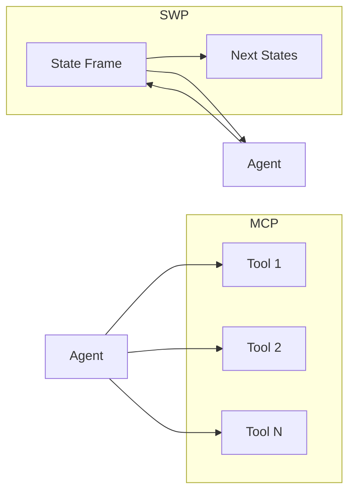

# Stateful Workflow Protocol (SWP)

**SWP is a lean, agent-native replacement for MCP.** While MCP treats agents as "tool-callers" with a static menu of capabilities, SWP treats them as **process executors** navigating a **Finite State Machine (FSM)**. The server exposes only the context that matters for the current step—a **State Frame**—so agents stay token-efficient and deterministic.



---

## Why SWP?

| | **MCP (legacy)** | **SWP (agent-native)** |
|---|------------------|-------------------------|
| **Token usage** | High: loads all tool schemas up front | **Minimal**: only current state + one skill |
| **Control** | Probabilistic: agent guesses next step | **Deterministic**: server enforces valid paths |
| **Logic** | Scattered in prompt/client | **Centralized** in FSM + SKILL.md |
| **Async** | Request-response; long tasks time out | **Async-first**: Streamable HTTP / NDJSON |
| **Integration** | Requires MCP SDKs/servers | **Zero-package**: standard HTTP + JSON |

**SWP is the GPS.** The server tells the agent: *You are here; these are the only valid next actions.*

---

## The State Frame

Every SWP response is a **State Frame**—the single source of truth for the run:

| Field | Purpose |
|-------|--------|
| `run_id` | Unique execution instance; used for resumption and stream |
| `workflow_id` | Workflow blueprint (e.g. `document-approval-v1`) |
| `state` | Current FSM node (e.g. `AWAITING_AUDIT`) |
| `status` | `active` \| `processing` \| `awaiting_input` \| `completed` \| `failed` |
| `hint` | Natural language guidance for the LLM (system-prompt bridge) |
| `active_skill` | Optional link to a SKILL.md; load only in this state |
| `next_states` | Valid transitions: `action`, `method`, `href`, `expects` |
| `stream_url` | Where to listen for NDJSON state updates |

**Progressive disclosure:** Only the current state and its `next_states` are exposed. No tool overload.

---

## Agent Skills

SWP integrates with the [Open Agent Skill](https://cursor.com/docs/agents/skills) spec. When a State Frame includes `active_skill`, the client:

1. Fetches the skill from `active_skill.url` (e.g. a SKILL.md).
2. Injects its content into the LLM system message or history.

Skills are **just-in-time**: only the skill for the current state is loaded, keeping context minimal.

---

## Async-first: Streamable HTTP

Long-running steps use **NDJSON** (Newline-Delimited JSON) over a single HTTP connection:

- **GET** `stream_url` with `Accept: application/x-ndjson` to receive State Frames as they change.
- Optional **Unified Endpoint**: a **POST** to a transition can return **202 Accepted** and immediately stream NDJSON on the same connection.

No polling; the server pushes updates. Resumption is supported via `Mcp-Session-Id` and `Last-Event-ID`.

---

## Quickstart

### Python (FastAPI)

```bash
cd sdks/python && pip install -e . && pip install uvicorn
```

```python
from swp import SWPWorkflow, TransitionDef, create_app

transitions = [
    TransitionDef(from_state="INIT", action="start", to_state="DONE"),
]
workflow = SWPWorkflow("my-wf", "INIT", transitions).hint("INIT", "Start here.")
app = create_app(workflow)
# Run: uvicorn app:app --reload
```

### TypeScript (Hono)

```bash
cd sdks/typescript && npm install && npm run build
```

```typescript
import { createApp, SWPWorkflow } from "./src/index.js";

const transitions = [{ from_state: "INIT", action: "start", to_state: "DONE" }];
const workflow = new SWPWorkflow("my-wf", "INIT", transitions).hint("INIT", "Start here.");
const app = create_app(workflow);
// Serve with @hono/node-server or your adapter
```

### Client (any language)

```bash
# Start a run
curl -X POST http://localhost:8000/runs -H "Content-Type: application/json" -d '{"data":{}}'

# Get current frame
curl http://localhost:8000/runs/<run_id>

# Trigger transition
curl -X POST http://localhost:8000/runs/<run_id>/transitions/start -H "Content-Type: application/json" -d '{}'
```

---

## Repository layout

| Path | Description |
|------|-------------|
| `spec/` | PROTOCOL.md, STATE_FRAME.json, SKILL_INTEGRATION.md |
| `sdks/python/` | FastAPI server, Pydantic models, SWPClient, LLM wrapper, visualizer |
| `sdks/typescript/` | Hono server, Zod models, SWPClient, LLM wrapper, visualizer |
| `skills/` | Example Agent Skills (SKILL.md) for audit, upload, approval, lint |
| `examples/` | legal-review-flow (Python), ci-cd-bot (TypeScript) |
| `tests/` | Python (pytest) and TypeScript (Vitest) unit + integration |

---

## Visualizer

Both SDKs expose a **Mermaid.js** FSM diagram:

- **Python**: `GET /visualize?run_id=<id>` (optional highlight of current state).
- **TypeScript**: `GET /visualize?run_id=<id>`.

Use it to debug runs and share workflow structure.

---

## License

MIT.
